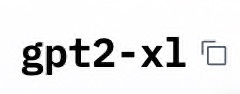

# CulinaryAI-Server

## Setup

After cloning the repository, run the following commands to create a virtual environment in your backend directory:

MacOS/Linux:

```
python3 -m venv venv
```

Windows:

```
python -m venv venv
```

</br>

Change into the virtual environment directory:

```
cd .venv
```

</br>

Then, activate the virtual environment:

MacOS/Linux:

```
source venv/bin/activate
```

Windows:

```
.\Scripts\Activate.ps1
```

</br>

Install the required packages provided in the requirements.txt file:

MacOS/Linux:

```
pip install -r ../requirements.txt
```

Windows:

```
pip install -r ..\requirements.txt
```

</br>

The download of PyTorch depends on your system. If you have a CUDA-enabled GPU with **Windows**, you can install the GPU version of PyTorch.
First download CUDA (Version 11) from [here](https://developer.nvidia.com/cuda-downloads?target_os=Windows) and then run the following command:

Windows with CUDA-GPU:

```
pip install torch torchvision torchaudio --index-url https://download.pytorch.org/whl/cu121
```

If you use a Mac, you can´t use CUDA, so just run the following command:

Mac:

```
pip install torch torchvision torchaudio
```

</br>

To be able to access models on HuggingFace you need to have an access token. You can get one by signing up on [HuggingFace](https://huggingface.co/join). Navigate to your profile, then to 'Access Tokens' and create a new token with `READ` as role. </br>

Then, create a file called `.env` in the root directory of the project and add the following line to it: </br>

```
HF_TOKEN="YOUR_TOKEN"
```

NOTE: Files starting with a dot are hidden by default. To see them in your file explorer, you need to enable the option to show hidden files.

## Usage

On HuggingFace, choose the model you want to use and click on the button next to the model name to copy the correct name. </br>



Insert it into the `model` and `tokenizer` variables. Play around with the `ìnput_text` variable to get different results. </br>
Then, run `run.py`.

If you use the model for the first time, it will be downloaded and saved in the following directories: </br>

MacOS:

```
user/.cache/huggingface/hub
```

Windows:

```
C:\Users\user\.cache\huggingface\hub
```

Also, if you run out of storage, you can delete the models in this directory.
